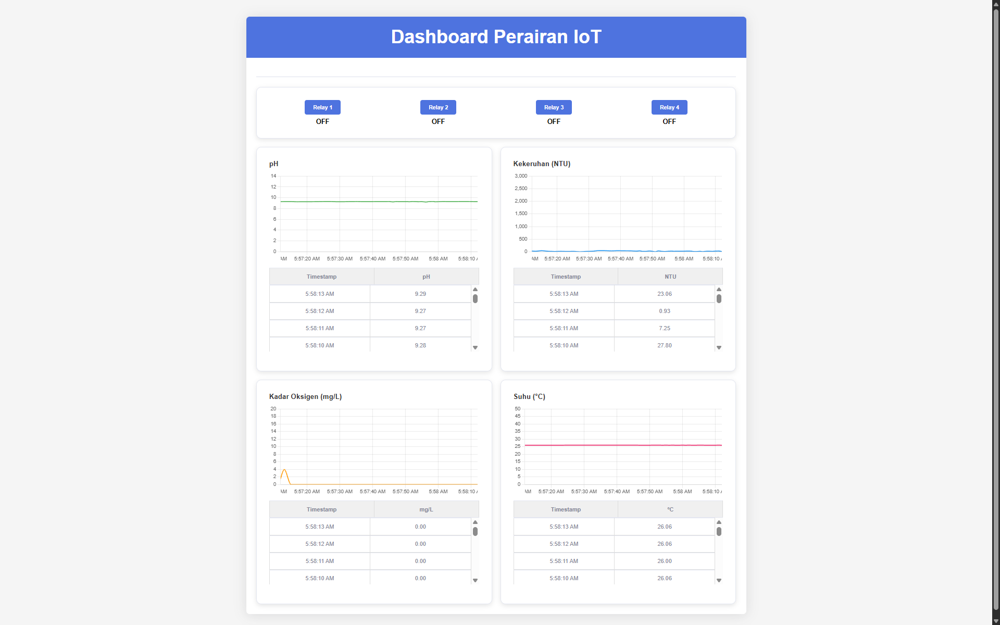
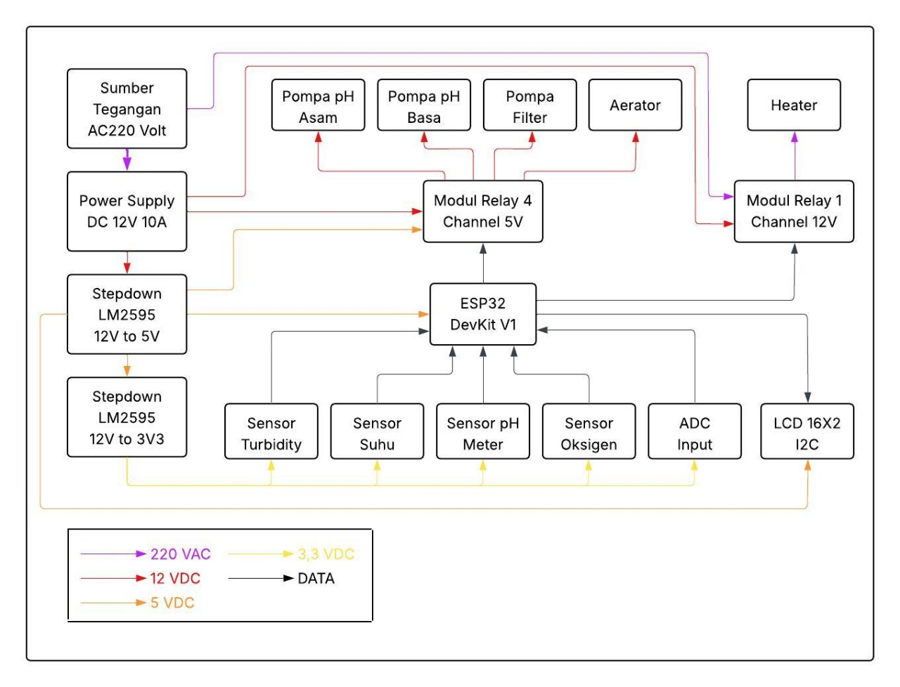

# training-kit-budidaya-perikanan

Proyek ini menyediakan solusi lengkap untuk memantau kualitas air menggunakan ESP32. Alat ini mengukur pH, kekeruhan, oksigen terlarut, dan suhu, lalu menampilkannya secara *real-time* pada dasbor web. Proyek ini juga memungkinkan kontrol hingga empat relay melalui antarmuka web.





-----

## Fitur

  - **Pemantauan Real-time**: Melacak pH, Kekeruhan (NTU), Oksigen Terlarut (mg/L), dan Suhu (°C).
  - **Dasbor Berbasis Web**: Memvisualisasikan data menggunakan grafik dan tabel dinamis yang disajikan langsung dari ESP32.
  - **Kontrol Relay**: Mengendalikan hingga 4 perangkat (seperti pompa, aerator, atau lampu) langsung dari dasbor.
  - **Mode Jaringan Ganda**: Dapat beroperasi sebagai klien Wi-Fi (terhubung ke jaringan yang ada) atau sebagai Access Point mandiri.
  - **Tampilan Lokal**: Menampilkan data sensor terkini pada layar LCD I2C 16x2.
  - **mDNS Support**: Akses dasbor dengan mudah di jaringan lokal menggunakan nama yang mudah diingat (misalnya, `http://esp32.local`).

-----

## Kebutuhan Hardware

| Komponen | Jumlah | Deskripsi |
| :--- | :---: | :--- |
| ESP32 Dev Board | 1 | Mikrokontroler utama. |
| Sensor pH | 1 | Untuk mengukur keasaman/alkalinitas air. |
| Sensor Kekeruhan | 1 | Untuk mengukur kekeruhan air (NTU). |
| Sensor Oksigen Terlarut | 1 | Untuk mengukur kadar O₂ dalam air (mg/L). |
| Sensor Suhu DS18B20 | 1 | Tipe tahan air, untuk mengukur suhu air. |
| Modul Relay 4-Channel | 1 | Untuk mengendalikan perangkat eksternal. |
| Layar LCD I2C 16x2 | 1 | Untuk tampilan data lokal. |
| Resistor 4.7kΩ | 1 | Resistor pull-up untuk jalur data DS18B20. |
| Breadboard & Kabel | - | Untuk menghubungkan komponen. |

-----

## Diagram Pengkabelan

Hubungkan semua komponen ke ESP32 sesuai dengan definisi pin dalam kode:

| Komponen | Pin ESP32 |
| :--- | :--- |
| Sensor pH (Analog Out) | `GPIO 32` |
| Sensor Kekeruhan (Analog Out) | `GPIO 33` |
| Sensor Oksigen Terlarut (Analog Out) | `GPIO 34` |
| Pin Data DS18B20 | `GPIO 23` (dengan pull-up 4.7kΩ ke 3.3V) |
| Relay 1 (IN1) | `GPIO 14` |
| Relay 2 (IN2) | `GPIO 27` |
| Relay 3 (IN3) | `GPIO 26` |
| Relay 4 (IN4) | `GPIO 25` |
| LCD I2C (SDA) | `GPIO 21` (SDA default ESP32) |
| LCD I2C (SCL) | `GPIO 22` (SCL default ESP32) |

**Catatan**: Pastikan semua sensor dan modul mendapatkan daya yang benar (umumnya 3.3V atau 5V, periksa datasheet masing-masing).

-----

## Pengaturan dengan PlatformIO

### 1\. Prasyarat

1.  Instal **Visual Studio Code**.
2.  Instal ekstensi **PlatformIO IDE** dari marketplace VS Code.

### 2\. Struktur Proyek

Buat proyek baru di PlatformIO untuk board ESP32 Anda. Struktur folder proyek Anda akan terlihat seperti ini:

```
├── data
│   ├── sb-admin-2.css
│   ├── chart.js
│   ├── script.js
│   └── ... (file web lainnya)
├── src
│   └── main.cpp
├── platformio.ini
```

  - Letakkan file kode utama (`.cpp`) di dalam folder `src`.
  - Buat folder `data` di root proyek untuk menyimpan semua file web.

### 3\. Konfigurasi `platformio.ini`

Ini adalah file konfigurasi utama untuk proyek Anda. PlatformIO akan secara otomatis mengunduh library yang diperlukan. Salin konten berikut ke file `platformio.ini` Anda:

```ini
[env:esp32dev]
platform = espressif32
board = esp32dev
framework = arduino

monitor_speed = 115200

# Opsi untuk membangun filesystem SPIFFS
board_build.filesystem = spiffs

# Dependensi Library
lib_deps =
    paulstoffregen/OneWire@^2.3.7
    milesburton/DallasTemperature@^3.9.1
    fdebrabander/LiquidCrystal_I2C@^1.1.2
```

**Catatan**: Anda mungkin perlu mengubah `board = esp32dev` agar sesuai dengan model board ESP32 yang Anda gunakan.

### 4\. Konfigurasi Kode

Buka file `main.cpp` di dalam folder `src` dan konfigurasikan konstanta berikut di bagian atas file:

  - **Mode Jaringan**:
    ```cpp
    #define MODE_WIFI_OR_AP "ap" // Ubah ke "wifi" untuk mode Access Point
    ```
  - **Kredensial AP Tethering** (jika menggunakan mode `"wifi"`):
    ```cpp
    const char *ap_ssid = "Trainer_Akuaponik";
    const char *ap_password = "12345678";
    ```
  - **Kalibrasi Sensor**: Sesuaikan nilai kalibrasi untuk sensor sesuai dengan datasheet atau prosedur kalibrasi Anda.

### 5\. Upload File Web & Kode

PlatformIO menyederhanakan proses upload.

1.  **Siapkan File Web**: Tempatkan semua file web yang diperlukan di dalam folder `data`:

      * `sb-admin-2.css`
      * `chart.js`
      * `luxon.js`
      * `chartjs-adapter-luxon.js`
      * `chartjs-plugin-streaming.js`
      * `script.js`

2.  **Upload Filesystem**: Gunakan fitur PlatformIO untuk mengunggah folder `data` ke SPIFFS.

      * Klik ikon **PlatformIO** di bilah sisi VS Code.
      * Di bawah `Project Tasks`, buka `env:esp32dev` \> `Platform`.
      * Klik **Upload Filesystem Image**.

3.  **Upload Kode**: Setelah filesystem berhasil diunggah, unggah kode utama Anda.

      * Klik tombol **Upload** (ikon panah kanan) di bilah status bawah VS Code.

-----

## Cara Penggunaan

1.  Setelah proses upload selesai, ESP32 akan terhubung ke Wi-Fi atau memulai Access Point-nya sendiri.
2.  Buka **Serial Monitor** di PlatformIO (ikon steker di bilah status bawah) dengan baud rate `115200` untuk melihat alamat IP.
3.  Buka browser web di perangkat yang terhubung ke jaringan yang sama dan navigasikan ke:
      * Alamat IP yang ditampilkan (misalnya, `http://192.168.1.100`).
      * Atau, jika jaringan Anda mendukung mDNS: `http://esp32.local`.
4.  Anda akan melihat dasbor dengan data sensor yang diperbarui secara langsung.
5.  Klik tombol "Relay" untuk menyalakan atau mematikan relay. Statusnya akan langsung diperbarui di dasbor.